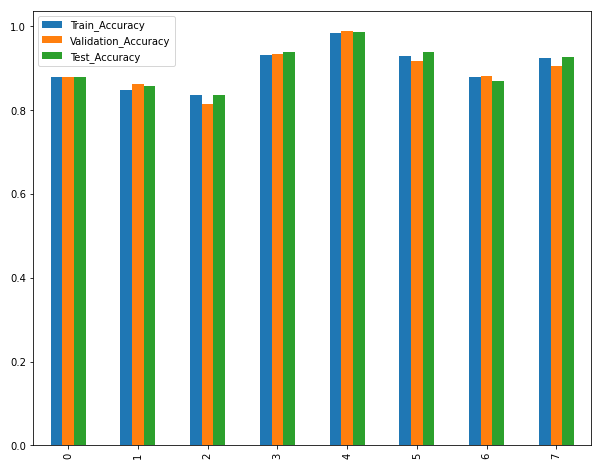

# DeepNeuralNets_Plant-Seedlings

Several Architectures were tried as listed below. These ANNs were trainied in separate jupyter files due to limited GPU memory for the tensors.
All the architecture implementation are shown in [Plant Seedling Classification Project.ipynb](https://github.com/AdzTheDemon/DeepNeuralNets_Plant-Seedlings/blob/main/Plant%20Seedling%20Classification_Project_Submission.ipynb) file.
Saved models during the traning are loaded in the ipynb here to perform the assessment.

Note: Run the individual files of each Architecture to same the trained model. This trained model will be called by [Plant Seedling Classification Project.ipynb](https://github.com/AdzTheDemon/DeepNeuralNets_Plant-Seedlings/blob/main/Plant%20Seedling%20Classification_Project_Submission.ipynb)

## ANN Architectures 

0. Simple sequential CNN model with Batch Normalization
1. Slightly Deep CNN with Data Augumentation
2. AlexNet: Reference Paper https://papers.nips.cc/paper/2012/file/c399862d3b9d6b76c8436e924a68c45b-Paper.pdf
3. VGG16 (D) Architecture: Reference Paper: https://arxiv.org/pdf/1409.1556.pdf
4. Xception Architecture: Reference Paper: https://arxiv.org/pdf/1610.02357.pdf
5. ResNet-50 Architecture: Reference Paper: https://arxiv.org/pdf/1512.03385.pdf
6. GoogLeNet Architectur: Reference Paper: https://arxiv.org/abs/1409.4842 
7. Inception V3 - Transferlearning in Keras trained on ImageNet

## Result

Clearly Xception(#4) implementation has the heighest Score on the Test Set. And also it generilizes much better than other architectures.
